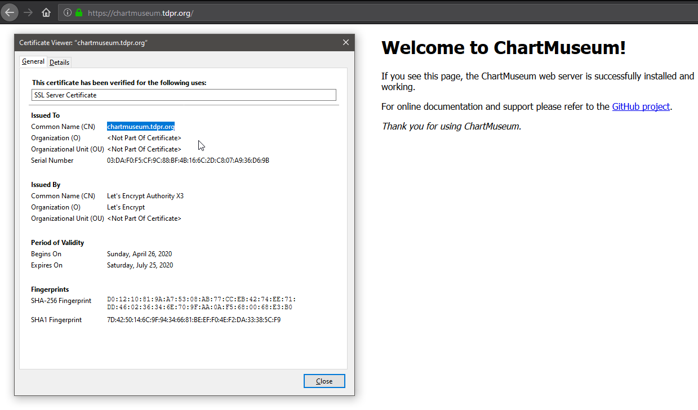
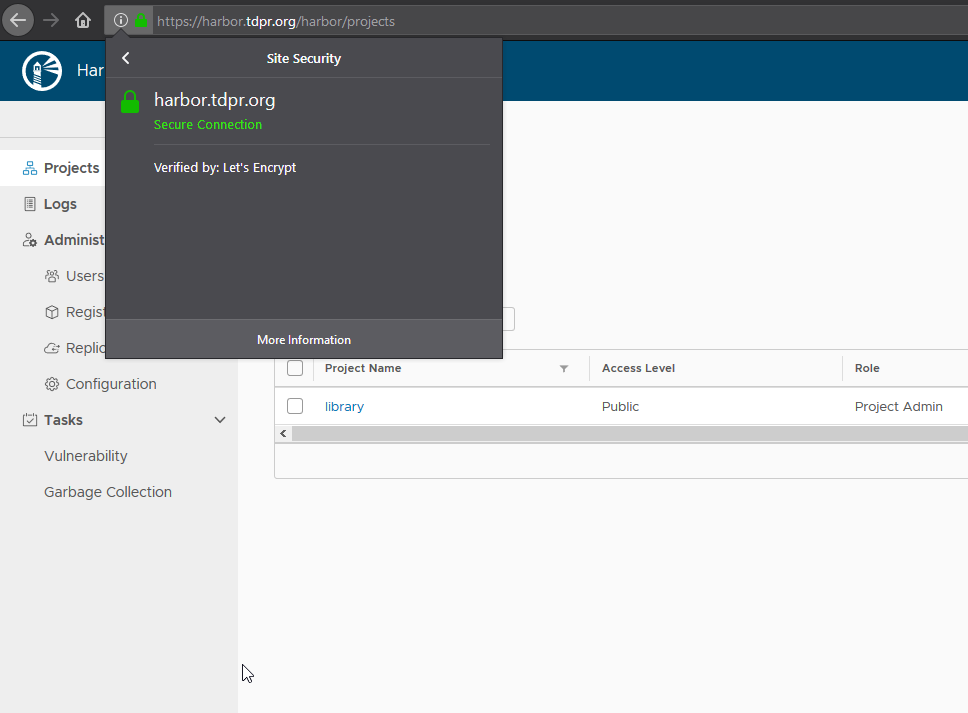
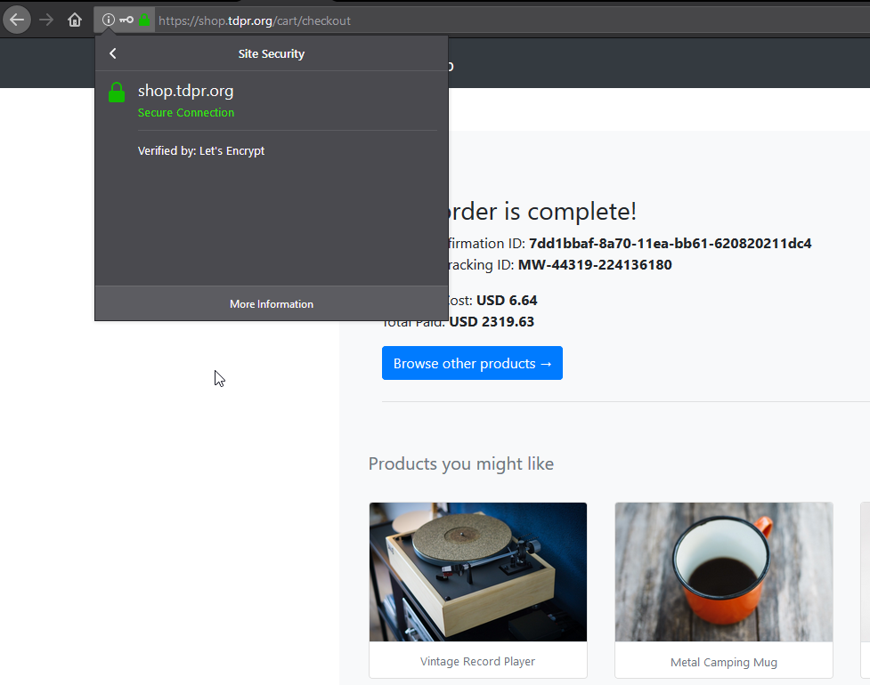

- ## [<<README](../README.md)

# Содержание
- [Add helm repo](#add-helm-repo)
- [Nginx ingress](#nginx-ingress)
- [cert-manager](#cert-manager)
- [ChartMuseum](#chartmuseum)
- [Harbor](#harbor)
- [Используем helmfile | Задание со ⭐](#-helmfile----)
- [Cвой helm chart](#c-helm-chart)
- [Создаем свой helm chart | Задание со ⭐](#--helm-chart----)
- [Kubecfg](#kubecfg)
- [Kustomize](#kustomize)


## Add helm repo

```bash
$ helm repo add stable https://kubernetes-charts.storage.googleapis.com

$ helm repo list
---------------------------------------------------------
NAME    URL
stable  https://kubernetes-charts.storage.googleapis.com
```

## Nginx ingress
- Установка
```bash
$ kubectl apply -f 01-nginx-ingress-namespaces.yaml

$ helm upgrade --install nginx-ingress stable/nginx-ingress --wait \
--namespace=nginx-ingress \
--version=1.11.1
```

- Проверка
```bash
kubectl -n nginx-ingress get services -o wide nginx-ingress-controller
--------------------------------------------------------------------------------
NAME                       TYPE           CLUSTER-IP     EXTERNAL-IP      PORT(S)                      AGE     SELECTOR
nginx-ingress-controller   LoadBalancer   10.59.250.69   35.204.166.210   80:31642/TCP,443:32056/TCP   2m18s   app=nginx-ingress,component=controller,release=nginx-ingress
```

## cert-manager
- Подготовка
```bash
$ helm repo add jetstack https://charts.jetstack.io
$ kubectl apply -f cert-manager/00-crds.yaml
$ kubectl apply -f cert-manager/01-cert-manager-namespaces.yaml
```

- Установка cert-manager
```bash
$ helm upgrade --install cert-manager jetstack/cert-manager --wait \
--namespace=cert-manager \
--version=0.9.0
```

- Проверка
```bash
$ kubectl get deploy -n cert-manager
---------------------------------------------------------------
NAME                      READY   UP-TO-DATE   AVAILABLE   AGE
cert-manager              1/1     1            1           59s
cert-manager-cainjector   1/1     1            1           59s
cert-manager-webhook      1/1     1            1           59s
```

- Тестовая конфигурация
```bash
$ kubectl apply -f cert-manager/test-resources.yaml
$ kubectl delete -f cert-manager/test-resources.yaml
```

- ClusterIssuers
```bash
$ kubectl apply -f cert-manager/02-letsencrypt-clusterissuer-staging.yaml
$ kubectl apply -f cert-manager/02-letsencrypt-clusterissuer-production.yaml

$ kubectl describe clusterissuer letsencrypt-staging
$ kubectl describe clusterissuer letsencrypt-production
$ kubectl get clusterissuers
------------------------------
NAME                     AGE
letsencrypt-production   15s
letsencrypt-staging      36s
```

## ChartMuseum

- Подготовка
```bash
$ kubectl apply -f chartmuseum/01-chartmuseum-ns.yaml
```

- Установка
```bash
$ helm upgrade --install chartmuseum stable/chartmuseum --wait \
--namespace=chartmuseum \
--version=2.3.2 \
-f chartmuseum/values.yaml
```

- Проверка
```bash
$ helm ls -n chartmuseum
-------------------------------------------------------------------------------------
NAME            NAMESPACE       REVISION        UPDATED                                 STATUS          CHART                   APP VERSION
chartmuseum     chartmuseum     1               2020-04-26 23:07:29.675214698 +0300 MSK deployed        chartmuseum-2.3.2       0.8.2

$ kubectl get certificates -n chartmuseum
----------------------------------------------------------------
NAME                   READY   SECRET                 AGE
chartmuseum.tdpr.org   True    chartmuseum.tdpr.org   2m25s
```



## Harbor

- Подготовка
```bash
$ kubectl apply -f harbor/01-harbor-ns.yaml
$ helm repo add harbor https://helm.goharbor.io
```

- Установка
```bash
$ helm upgrade --install harbor harbor/harbor --wait \
--namespace=harbor \
--version=1.1.2 \
-f harbor/values.yaml
```

- Проверка
```bash
$ helm ls -n harbor
------------------------------------------------------------------------------------------
NAME    NAMESPACE       REVISION        UPDATED                                 STATUS          CHART           APP VERSION
harbor  harbor          1               2020-04-27 11:52:05.889188391 +0300 MSK deployed        harbor-1.1.2    1.8.2
```



## Используем helmfile | Задание со ⭐

- Установка nginx-ingress, cert-manager, chartmuseum, harbor.
```bash
$ cd helmfile/
$ helmfile apply
```

- Проверка
```bash
$ kubectl get orders -A
------------------------------------------------------------
NAMESPACE     NAME                              STATE   AGE
chartmuseum   chartmuseum.tdpr.org-4062615230   valid   90s
harbor        harbor.tdpr.org-1137857252        valid   90s

$ kubectl get orders -A
----------------------------------------------------------------------------------------
NAMESPACE       NAME                            READY   UP-TO-DATE   AVAILABLE   AGE
cert-manager    cert-manager                    1/1     1            1           7m20s
cert-manager    cert-manager-cainjector         1/1     1            1           7m20s
cert-manager    cert-manager-webhook            1/1     1            1           7m20s
chartmuseum     chartmuseum-chartmuseum         1/1     1            1           7m17s
harbor          harbor-harbor-chartmuseum       1/1     1            1           7m16s
harbor          harbor-harbor-clair             1/1     1            1           7m15s
harbor          harbor-harbor-core              1/1     1            1           7m15s
harbor          harbor-harbor-jobservice        1/1     1            1           7m15s
harbor          harbor-harbor-portal            1/1     1            1           7m15s
harbor          harbor-harbor-registry          1/1     1            1           7m15s
kube-system     kube-dns                        2/2     2            2           23m
kube-system     kube-dns-autoscaler             1/1     1            1           23m
kube-system     l7-default-backend              1/1     1            1           23m
kube-system     metrics-server-v0.3.3           1/1     1            1           23m
nginx-ingress   nginx-ingress-controller        1/1     1            1           7m16s
nginx-ingress   nginx-ingress-default-backend   1/1     1            1           7m16s
```

## Cвой helm chart

- hipster-shop - подготовка
```bash
$ helm create hipster-shop
$ rm hipster-shop/values.yaml
$ rm -rf hipster-shop/templates/*
$ wget -P hipster-shop/templates/ https://raw.githubusercontent.com/express42/otus-platform-snippets/master/Module-04/05-Templating/manifests/all-hipster-shop.yaml
```

- hipster-shop - установка
```bash
$ kubectl apply -f 01-hipster-shop-namespace.yaml
$ helm upgrade --install hipster-shop hipster-shop/ -n hipster-shop
$ kubectl apply -f 02-shop-frontend-pub.yaml
```

- hipster-shop - frontend
```bash
$ helm create frontend
$ $ rm frontend/values.yaml
$ rm -rf frontend/templates/*
```
- hipster-shop - обновление helm-чарта
```bash
$ helm upgrade --install hipster-shop hipster-shop/ -n hipster-shop
```
- После обновления **hipster-shop** стал недоступен, pod `frontend` удалился
- Установка сервиса frontend для hipstershop
```bash
$ helm upgrade --install frontend frontend/ --namespace hipster-shop
```

- Добавлен файл `values.yaml` с переменной `image.tag:v0.1.3`
```bash
$ helm upgrade --install frontend frontend/ --namespace hipster-shop
```

- Добавление `frontend` как зависимость
```bash
$ helm delete frontend -n hipster-shop
$ vi hipster-shop/Chart.yaml
------------------------------------------
dependencies:
  - name: frontend
    version: 0.1.0
    repository: "file://../frontend"
------------------------------------------
$ helm dep update hipster-shop/
$ helm upgrade --install hipster-shop hipster-shop/ -n hipster-shop
```

## Создаем свой helm chart | Задание со ⭐

- Redis как зависимость используя старый формат `requirements.yaml`
```bash
$ helm create redis
$ rm redis/values.yaml
$ rm -rf redis/templates/*
```
- Вынес `Deployment` и `Service` в отдельный чарт `redis`
```bash
$ helm upgrade --install hipster-shop hipster-shop/ -n hipster-shop
```
- После обновления чарта **hipster-shop** онлайн магазин выдал ошибку приложения `HTTP Status: 500 Internal Server Error`
- Добавление redis как зависимость
```bash
$ helm dep update hipster-shop/
-------------------------------------------------------------------------------------------------------------------------
Warning: Dependencies are handled in Chart.yaml since apiVersion "v2". We recommend migrating dependencies to Chart.yaml
-------------------------------------------------------------------------------------------------------------------------

$ tree hipster-shop/charts/
-----------------------------------
hipster-shop/charts/
├── frontend-0.1.0.tgz
└── redis-0.1.0.tgz
```

- Обновление чарта **hipster-shop**
```bash
$ helm upgrade --install hipster-shop hipster-shop/ -n hipster-shop
```

- Проверка
```bash
$ vi repo.sh
--------------------------------------------------------------------
#/bin/bash

helm repo add templating https://harbor.tdpr.org/chartrepo/library
--------------------------------------------------------------------
$ helm delete hipster-shop -n hipster-shop
$ sh repo.sh && helm repo list
------------------------------------------------------------------------
NAME            URL
stable          https://kubernetes-charts.storage.googleapis.com
jetstack        https://charts.jetstack.io
harbor          https://helm.goharbor.io
templating      https://harbor.tdpr.org/chartrepo/library
-----------------------------------------------------------------------
$ helm upgrade --install hipster-shop templating/hipster-shop --wait \
--namespace=hipster-shop
```

- **hipster-shop** буз ошибок установился из harbor, сертификат валидный



## Kubecfg

- `paymentservice` и `shippingservice` убраны из манифеста **hipster-shops**, обновленный релиз загружен в Harbor
```bash
$ helm repo update
$ helm upgrade --install hipster-shop templating/hipster-shop --wait \
--namespace=hipster-shop \
--version=0.2.0
```
- После установки обновленного чарта перестала корректно работать "корзина" магазина

- Проверка и установка недостающих сервисов с помощью `kubecfg`
```bash
$ kubecfg show kubecfg/services.jsonnet
$ kubecfg update kubecfg/services.jsonnet --namespace hipster-shop
```
- Функционал онлайн магазина восстановился

## Kustomize

- `adservice` убран в отджельный манифест, обновленный релиз **hipster-shop** загружен в Harbor
```bash
$ helm repo update
$ helm upgrade --install hipster-shop templating/hipster-shop --wait \
--namespace=hipster-shop \
--version=0.3.0
```

- Подготовка
```bash
$ kubectl apply -f 02-hipster-shop-prod-namespace.yaml
$ kubectl get ns
```

- Проверка корректности манифестов
```bash
$ kubectl apply --dry-run=client -k kustomize/overrides/hipster-shop/
$ kubectl apply --dry-run=client -k kustomize/overrides/hipster-shop-prod/
```

- Запуск сервиса `adservice`
```bash
$ kubectl apply -k kustomize/overrides/hipster-shop/
$ kubectl apply -k kustomize/overrides/hipster-shop-prod/
```

- Проверка запуска подов в разных namespaces
```bash
$ kubectl get po -n hipster-shop
----------------------------------------------------------------------------
NAME                                     READY   STATUS    RESTARTS   AGE
adservice-67576c984-vwld7                1/1     Running   0          3m5s
cartservice-55b5599ccb-drp72             1/1     Running   0          116m
----------------------------------------------------------------------------

$ kubectl get po -n hipster-shop-prod
----------------------------------------------------------------------------
NAME                              READY   STATUS    RESTARTS   AGE
adservice-prod-775dd986cb-l64hm   1/1     Running   0          2m3s
```
